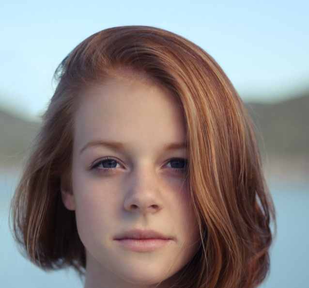

# PyTorch Face Re-aging Network (FRAN)

<table>
  <tr>
    <td></td>
    <td></td>
  </tr>
</table>


An unofficial PyTorch implementation of Disney's face re-aging network (FRAN) paper.

Paper Link: [link](https://studios.disneyresearch.com/2022/11/30/production-ready-face-re-aging-for-visual-effects/)

Dataset Link (collected according to the paper): [link](https://www.kaggle.com/datasets/penpentled/aged-synthetic-images)

## Setup
Python 3.12.2

```console
> pip install -r requirements.txt
```

For full training, download all 2000 subjects from the dataset link.

## Training
To train a new model
```console
> python train.py -h
usage: train.py [-h] [--data_dir DATA_DIR]

Train FRAN model.

options:
  -h, --help            show this help message and exit
  --data_dir DATA_DIR, -C DATA_DIR
                        directory for data

> python train.py

Using 16bit Automatic Mixed Precision (AMP)
GPU available: True (mps), used: True
TPU available: False, using: 0 TPU cores
IPU available: False, using: 0 IPUs
HPU available: False, using: 0 HPUs
Missing logger folder: /Users/ryanlu/Downloads/Projects/pytorch-face-reaging-network/lightning_logs

  | Name          | Type                  | Params
--------------------------------------------------------
0 | generator     | Generator             | 31.4 M
1 | discriminator | PatchGANDiscriminator | 1.6 M 
--------------------------------------------------------
32.9 M    Trainable params
0         Non-trainable params
32.9 M    Total params
131.800   Total estimated model params size (MB)
Epoch 0:   0%|                                                                       | 0/228 [00:00<?, ?it/s]
```

## Showcase
Applying the model + naive crop and masking.
Model was trained on a single V100 for 6 hours in Google Colab.

[Hugging Face Spaces](https://huggingface.co/spaces/penpen/age-transformation)

# Notes
Why does the image turn grainy/pixelated sometimes?

Model encountered an unfamilar face. More diverse data may help resolve this problem. 

Model is noticably worse with turning old people to young.  

